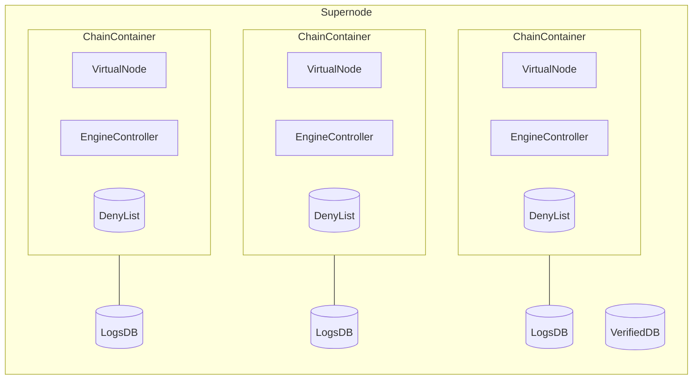

## Architecture

A `Supernode` includes the following components:

- A `VerifiedDB` storing the cross-validity history. The `VerifiedDB` contains an entry for every timestamp for which cross-validation has been performed. This entry is a `VerifiedResult` consisting of:
    - The verified timestamp $t$.
    - The L2 heads for each L2 chain at that timestamp. Since an L2 might not have a block at every timestamp, this is the highest block with timestamp $\leq t$.
    - The L1 head at which cross-validation at that timestamp can be performed. Note that each L2 head might be derived from a different L1 block, so the L1 head is the highest among those. In other words, it's the earliest L1 block at which all L2 heads are available.
- A `ChainContainer` for each L2 chain, itself including the following components:
    - An `EngineController`, which serves as an interface to the L2's execution layer. When cross-validation fails for a given timestamp, the `EngineController` for all affected chains rewinds the execution layer to the preceding timestamp by performing a fork choice update. This allows the execution layer to continue building the L2 chain on top of the most recent valid block.
    - A `VirtualNode`, an in-memory `OpNode` instance used to derive the Local Safe chain from L1 batch data. When checking cross-validity for a given timestamp, the `Supernode` queries each L2's `VirtualNode` to retrieve the logs up to the target timestamp. `VirtualNode`s are intented to be fungible: when cross-validation detects an invalid Executing Message, invalidating the Local Safe chain, the `VirtualNode` is destroyed and recreated after the `EngineController` has been reset to the previous timestamp and the invalid blocks have been added to the `DenyList`. This forces the `VirtualNode` to rederive the Local Safe chain, this time avoiding the newly-invalidated blocks.
    - A `DenyList` recording the blocks that have been invalidated during cross-validation. This `DenyList` is consulted by the `VirtualNode` when deriving the Local Safe chain to ensure that a block that has already been deemed invalid is not revisited. If the `VirtualNode` would derive a block that is present in the `DenyList`, it replaces it with a deposit-only block instead.
- A `LogsDB` for each L2 chain, storing the logs retrieved from the `VirtualNode` up to the latest verified timestamp.

## Cross-Validation Logic

The `Supernode` performs cross-validation one timestamp at a time, consistently incrementing the timestamp by 1 each time. If all L2 chains are caught up to the target timestamp, it downloads the logs for this timestamp and checks the Executing Messages for cross-validity. If they pass validation, the blocks are recorded in the `VerifiedDB`. Otherwise, the invalid blocks are recorded in the `DenyList` for their respective chains and the invalidated chains are rewound to the previous timestamp.

### Supernode State and Invariants

After performing cross-validation for timestamp $t$, and before performing cross-validation for $t + 1$, the internal state of the `Supernode` for a set of $k$ L2 chains consists of the following:

- A `LogsDB` $L_j = (B^j_0, \ell^j_0), \ldots, (B^j_{n_j}, \ell^j_{n_j})$ for each L2 chain $j$, where $B^j_i$ is a block from chain $j$ and $\ell^j_i$ is the list of logs of $B^j_i$.
- A `VerifiedDB` containing the cross-validity history, given by $(t_0, C_{t_0}, C^1_{t_0}, \ldots, C^k_{t_0}), \ldots, (t, C_t, C^1_t, \ldots, C^k_t)$, where $t_0$ is the activation timestamp, $t$ is the last verified timestamp, and for each timestamp $t_0 \leq i \leq t$:
    - $C^1_i, \ldots, C^k_i$ are the verified L2 heads for timestamp $i$ for each of the $k$ L2 chains.
    - $C_i$ is the verified L1 head for timestamp $i$.
- A `DenyList` $D_j$ for each L2 chain $j$, containing blocks from chain $j$ that were invalidated at timestamps $\leq t + 1$.

The following invariants are expected to be true at this state:

- $\ell^j_i$ is the list of logs for block $B^j_i$, for all $i$ and $j$.
- $B^j_i$ is the parent block of $B^j_{i+1}$, for all $i$ and $j$.
- Every $B^j_i$ is cross-valid given the cross-validity history for timestamps $\leq i$. In other words, all Executing Messages in $\ell^j_i$ are valid and are not part of a cycle.
- $C^j_{t_0} = B^j_0$, for all $j$.
- $C^j_t = B^j_{n_j}$, for all $j$.
- $C^j_i$ is either equal to $C^j_{i+1}$ or its parent, for all $i$ and $j$ (consequently, $C^j_{t_0}, \ldots, C^j_t$ is equal to $B^j_0, \ldots, B^j_{n_j}$ with possible repetitions in the middle).
- $C^j_i$ is the highest block on its chain with timestamp $\leq i$. In other words, all children of $C^j_i$ have timestamp $> i$.
- $C_{t_0}, \ldots, C_t$ are all part of the same linear chain (but there might be missing blocks in the middle).
- $C_i$ is the earliest L1 block on its linear chain where all L2 blocks $C^1_i, \ldots, C^k_i$ are available. In other words, $C_i$ is the highest among the L1 blocks from which $C^1_i, \ldots, C^k_i$ were derived.
- $B^j_i \not \in D_j$ for any $j$ and $i$. In other words, a block in the `LogsDB` (and, consequently, in the `VerifiedDB`) does not appear in the `DenyList`.
- For every block $B \in D_j$, the timestamp of $B$ is $\leq t + 1$ (note that the `DenyList` _can_ contain invalidated blocks for the next timestamp $t + 1$, added from previous unsuccessful attempts to cross-validate $t + 1$).

At the initial state of the `Supernode`, the `LogsDB`s, `DenyList`s and `VerifiedDB` are all empty. As a consequence, all of the above invariants hold by default in this state.

### Assumptions on the L1 and L2 Chain

During a round of cross-validation, the Supernode queries the state of the L1 chain (via an `L1Client`) and L2 chains (via the chain's respective `VirtualNode`). When making these queries, we make the following assumptions about the state and behavior of the L1 and L2 chains:

- Timestamps don't repeat, i.e., there is at most one block per chain per timestamp.
- Outside of cross-validation, an L2 chain will only reorg if the L1 chain reorgs. This also means that by the time we are able to observe the results of a reorg in L2, we must necessarily be able to observe it in L1 as well. Note, however, that the reverse is not true: we might be able to observe that the L1 has had a reorg before an L2 chain has been able to sync up.
- Assuming sufficient time between L1 reorgs, each L2 chain will _eventually_ sync up to the L1.
- If an L2 chain $j$ tries to derive a block that's in its `DenyList` $D_j$, it will instead insert a deposit-only block in its place. Since the `VirtualNode` for an L2 chain is always destroyed and recreated after a block is added to the `DenyList`, forcing it to rederive the safe chain, we can guarantee that at the start of a round of cross-validation the safe chain for an L2 will never have a block that's currently in its `DenyList`.
- Technically speaking, L1 and L2 chains can reorg at any point between two rounds of cross-validation, or even in the middle of a round. Because of this, any chain can at any point be inconsistent with the other chains, with the internal state of the Supernode, or even with previous queries made to the same chain. Therefore, we should assume that any queries to the state of the L1/L2s during a round can return an arbitrary result, except for what the assumptions above guarantee.

### State Changes from Cross-Validation

The following state changes happen after a round of cross-validation (with last verified timestamp $t$ and next timestamp $t + 1$):

1. For each L2 chain $j$, let $B_j$ be the highest block on safe chain $j$ with timestamp $\leq t + 1$. If there should be a higher block with timestamp $\leq t + 1$ (note that this can be predicted based on the L2 chain's block time) but it hasn't been derived yet, no state update happens (need to wait for chain $j$ to catch up to the next timestamp $t + 1$).
2. Otherwise, let $B'_j$ the L1 block from from which $B_j$ was derived. If the $B'_j$ are not all in the same linear chain, this means that a reorg has happened and some of the L2s haven't synced. In that case, no state update happens (we wait until next round to give the L2s time to sync up).
3. Otherwise, if $C_t$ is not in the same linear chain as the $B'_j$, this means that $C_t$ has been reorged out and is no longer a valid L1 block. Therefore, we need to roll back to the previous timestamp to cross-validate again:
    - The cross-validity history in the `VerifiedDB` is pruned to $(t_0, C_{t_0}, C^1_{t_0}, \ldots, C^k_{t_0}), \ldots, (t-1, C_{t-1}, C^1_{t-1}, \ldots, C^k_{t-1})$ by removing the last entry $(t, C_t, C^1_t, \ldots, C^k_t)$.
    - Every `DenyList` $D_j$ is pruned by removing all entries with timestamp $\geq t$ (i.e. $t$ or $t + 1$).
    - For every chain $j$ such that $C^j_{t-1} \neq B^j_{n_j}$, the `LogsDB` $L_j$ is pruned to $(B^j_0, \ell^j_0), \ldots, (B^j_{n_j-1}, \ell^j_{n_j-1})$ by removing the last entry $(B^j_{n_j}, \ell^j_{n_j})$.
4. Otherwise, since every $B_j$ is consistent with the latest verified L1 block $C_t$, it must be on the same linear chain as $C^j_t = B^j_{n_j}$. Then, since there is at most one block per timestamp and $B^j_{n_j}$ has timestamp $t$, either $B_j = B^j_{n_j}$ or $B^j_{n_j}$ is $B_j$'s parent. $B_j$ is invalid if it has an invalid Executing Message or an Executing Message that is part of a cycle. If any $B_j$ is invalid, then
    - Each invalid $B_j$ is added to its respective `DenyList` $D_j$.
    - For each chain $j$ such that $B_j$ is invalid, the `ChainContainer` is reset by (a) rewinding the `EngineController` to the highest block with timestamp $\leq t$, and (b) destroying and recreating the `VirtualNode`. Since this will force the `VirtualNode` to rederive the safe chain, and now $B^j$ is in the `DenyList`, it will replace the invalid block with a deposit-only block.
    - Note that no `LogsDB` should be updated in this case, so any logs that have been added in the cross-validation process must be removed again.
5. Otherwise (if all $B_j$ are valid), then
    - The cross-validity history is extended to $(t_0, C_{t_0}, C^1_{t_0}, \ldots, C^k_{t_0}), \ldots, (t, C_t, C^1_t, \ldots, C^k_t), (t+1, C_{t+1}, C^1_{t+1}, \ldots, C^k_{t+1})$, where $C^j_{t+1} = B_j$ and $C_{t+1}$ is the highest L1 block among $B'_1, \ldots, B'_k$ (the blocks from which $C^1_{t+1}, \ldots, C^k_{t+1}$ were derived).
    - Every logs database $L_j$ such that $B_j \neq B^j_{n_j}$ is extended to $(B^j_0, \ell^j_0), \ldots, (B^j_{n_j}, \ell^j_{n_j}), (B^j_{n_j+1}, \ell^j_{n_j+1})$, where $B^j_{n_j+1} = B_j$ and $\ell^j_{n_j+1}$ is the list of logs for $B^j_{n_j+1}$.

